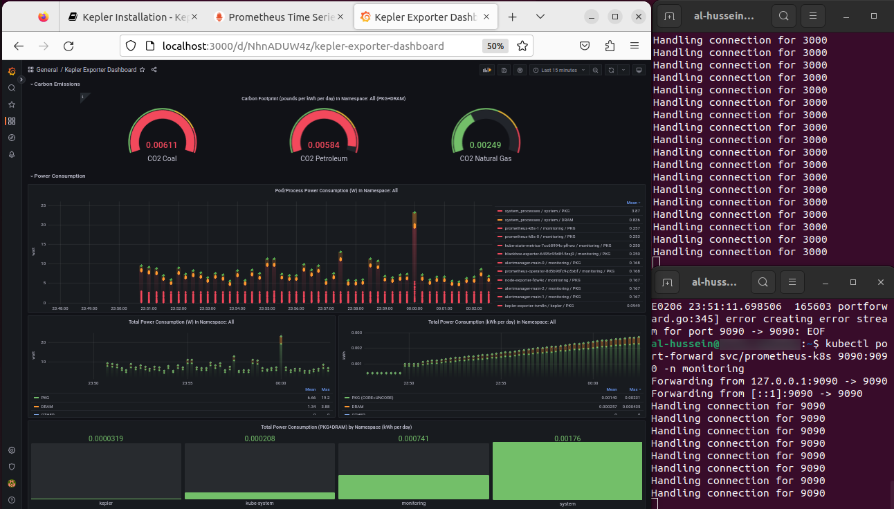

# Kepler Installation Guide

This guide will show you how to install Kepler, a lightweight pod-level power consumption metrics exporter, on a Minikube cluster running on an Ubuntu 22.04 host.

## Prerequisites

Before you begin, you'll need to have the following:

- Kernel 4.18+
- Docker installed
- Make and go packages installed
- kubectl command-line tool installed
- Helm command-line tool installed

## Installation steps

Start by installing Minikube on your machine. You can follow the instructions in the [Minikube documentation](https://minikube.sigs.k8s.io/docs/start/).
I ran the following commands:

```bash
curl -LO https://storage.googleapis.com/minikube/releases/latest/minikube-linux-amd64
sudo install minikube-linux-amd64 /usr/local/bin/minikube
sudo usermod -aG docker $USER && newgrp docker
```

Once you have Minikube installed, start a new cluster using the following command (CPUs and Memory values can be customized):

```bash
# check CPU cores
lscpu | grep "CPU(s)"
# start the cluster
minikube start --cpus 4 --memory 4096
```

Next, install the Prometheus Operator on your cluster by running the following commands:

```bash
git clone https://github.com/prometheus-operator/kube-prometheus.git
cd kube-prometheus/
kubectl apply --server-side -f manifests/setup
kubectl wait --for condition=Established --all CustomResourceDefinition	--namespace=monitoring
kubectl apply -f manifests/
cd ../
```

Clone Kepler repository and generate manifest files by running the following commands:

```bash
git clone https://github.com/sustainable-computing-io/kepler.git -b v0.4
cd kepler/
# to configure Prometheus to scrape Kepler-exporter endpoints, Kepler exporter servicemonitor object is required
make build-manifest OPTS="PROMETHEUS_DEPLOY"
# update the NODE_NAME to localhost in the deployment manifest when using Minikube
```

Deploy Kepler v0.4 to your cluster by running the following command:

```bash
kubectl apply -f _output/generated-manifest/deployment.yaml
cd ../
```

Once Kepler is deployed, verify that Kepler is working by running the following commands:

```bash
# get Kepler's pod name
kubectl get pods -n kepler
# check Kepler's logs
kubectl logs kepler-exporter-<xxxxx> -n kepler -f
# get kepler related metrics
kubectl exec -ti -n kepler daemonset/kepler-exporter -- bash -c "curl localhost:9102/metrics"
# or
kubectl port-forward kepler-exporter-<xxxxx> 9102:9102 -n kepler
# run the following command in another window while keeping port-forward running
curl http://localhost:9102/metrics
```

View Kepler metrics that have been exported to Prometheus and visualized with Grafana [Kepler's dashboard](https://github.com/sustainable-computing-io/kepler/blob/main/grafana-dashboards/Kepler-Exporter.json) by running the following commands:

```bash
# to view grafana dashboard, port-forward grafana svc and import Kepler's dashboard
kubectl port-forward svc/grafana 3000:3000 -n monitoring 
# to view metrics in prometheus UI
kubectl port-forward svc/prometheus-k8s 9090:9090 -n monitoring
```

## Conclusion

That's it! You should now have Kepler up and running on your Minikube cluster with power consumption metrics being exported.



## Clean up

To remove kepler related objects, run the following commands:
```bash
kubectl delete ns kepler
kubectl delete clusterrole kepler-clusterrole
kubectl delete clusterrolebinding kepler-clusterrole-binding
```
